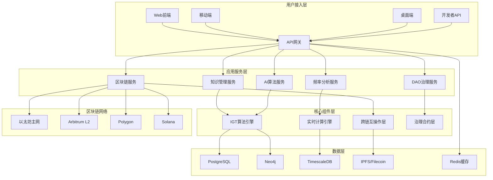

# 信息元宇宙平台架构设计文档

## 1. 架构设计概述

基于信息基因论（IGT）v7.0 理论框架，信息元宇宙平台采用分层微服务架构，融合区块链、人工智能、大数据处理等前沿技术，构建一个支持知识进化、AI意识涌现、经济激励和DAO治理的综合性平台。

### 1.1 架构原则

1. **分层解耦**: 各层职责单一，便于独立演进
2. **微服务化**: 按业务域拆分服务，支持独立部署扩展
3. **事件驱动**: 基于事件总线的异步通信机制
4. **数据一致性**: 最终一致性模型，支持分布式事务
5. **安全优先**: 零信任架构，多层安全防护
6. **可观测性**: 全链路监控，实时状态感知

### 1.2 核心架构特征

- **多链支持**: 以太坊、Solana、Polkadot等主流公链
- **跨链互操作**: 支持资产和数据跨链流转
- **AI原生**: 内置机器学习管道和模型服务
- **实时处理**: 毫秒级频率数据处理能力
- **水平扩展**: 支持百万级用户并发访问

## 2. 总体架构

### 2.1 架构分层

```
┌─────────────────────────────────────────────────────────────┐
│                    用户接入层                                  │
├─────────────────────────────────────────────────────────────┤
│  Web端  │  移动端  │  桌面端  │  API网关  │  开发者门户   │
└─────────────────────────────────────────────────────────────┘
                              │
┌─────────────────────────────────────────────────────────────┐
│                    应用服务层                                │
├─────────────────────────────────────────────────────────────┤
│  知识管理  │  AI服务  │  区块链  │  频率分析  │  DAO治理     │
│  服务      │         │  服务    │  服务      │  服务        │
└─────────────────────────────────────────────────────────────┘
                              │
┌─────────────────────────────────────────────────────────────┐
│                    业务逻辑层                                │
├─────────────────────────────────────────────────────────────┤
│  IGT算法  │  共识机制  │  经济模型  │  治理逻辑  │  安全策略   │
│  引擎     │           │          │          │           │
└─────────────────────────────────────────────────────────────┘
                              │
┌─────────────────────────────────────────────────────────────┐
│                    数据存储层                                │
├─────────────────────────────────────────────────────────────┤
│  关系数据库 │  图数据库  │  时序数据库  │  分布式存储     │
│  PostgreSQL │  Neo4j   │  TimescaleDB │  IPFS+Filecoin │
└─────────────────────────────────────────────────────────────┘
                              │
┌─────────────────────────────────────────────────────────────┐
│                    基础设施层                                │
├─────────────────────────────────────────────────────────────┤
│  容器平台  │  服务网格  │  监控系统  │  日志系统  │  CI/CD    │
│  Kubernetes │  Istio    │  Prometheus │  ELK Stack │  GitLab  │
└─────────────────────────────────────────────────────────────┘
```

### 2.2 技术架构图



## 3. 核心子系统架构

### 3.1 知识管理子系统

#### 3.1.1 功能架构

```
知识管理子系统
├── 知识录入层
│   ├── 文本知识提取
│   ├── 多媒体内容解析
│   └── 结构化数据导入
├── 知识处理层
│   ├── IGT基因编码
│   ├── 语义理解分析
│   └── 质量评估打分
├── 知识存储层
│   ├── 共识知识库(CKB)
│   ├── 个人知识空间
│   └── 协作知识图谱
└── 知识服务层
    ├── 知识检索
    ├── 知识推荐
    └── 知识可视化
```

#### 3.1.2 数据模型

```typescript
// 知识节点实体
interface KnowledgeNode {
  id: string;
  title: string;
  content: string;
  igtGene: IGTGene;           // IGT基因编码
  creator: string;              // 创建者DID
  timestamp: number;
  coherence: number;            // 一致性分数
  sti: number;                  // 尺度不变性指数
  category: KnowledgeCategory;
  tags: string[];
  metadata: Record<string, any>;
}

// IGT基因结构
interface IGTGene {
  o_freq: number;               // 单尺度有序度
  i_sti: number;                // 尺度不变性指数
  e_rate: number;               // 涌现率
  frequency_signature: string;  // 频率签名
  evolution_stage: RVSEStage;  // RVSE阶段
}

// 知识关系
interface KnowledgeRelation {
  id: string;
  from: string;                 // 源节点ID
  to: string;                   // 目标节点ID
  type: RelationType;           // 关系类型
  strength: number;             // 关系强度
  direction: RelationDirection;
  evidence: string[];           // 关系证据
}
```

#### 3.1.3 技术实现

**存储架构**:
- **主存储**: PostgreSQL存储知识元数据
- **图存储**: Neo4j存储知识关系图谱
- **内容存储**: IPFS存储大文本和多媒体内容
- **缓存层**: Redis缓存热点知识

**核心算法**:
```typescript
class KnowledgeProcessor {
  // IGT基因编码算法
  async encodeIGTGene(content: string): Promise<IGTGene> {
    const frequencies = await this.extractFrequencies(content);
    const o_freq = this.calculateOrderDegree(frequencies);
    const i_sti = this.calculateScaleInvariance(frequencies);
    const e_rate = this.calculateEmergenceRate(frequencies);
    
    return {
      o_freq,
      i_sti,
      e_rate,
      frequency_signature: this.generateSignature(frequencies),
      evolution_stage: this.determineStage(o_freq, i_sti, e_rate)
    };
  }

  // 知识质量评估
  async assessQuality(node: KnowledgeNode): Promise<QualityScore> {
    const coherence = await this.calculateCoherence(node);
    const consistency = await this.checkConsistency(node);
    const completeness = await this.assessCompleteness(node);
    
    return {
      overall: (coherence + consistency + completeness) / 3,
      coherence,
      consistency,
      completeness,
      timestamp: Date.now()
    };
  }
}
```

### 3.2 AI算法子系统

#### 3.2.1 系统架构

```
AI算法子系统
├── 数据预处理层
│   ├── 数据清洗
│   ├── 特征工程
│   └── 数据标注
├── 模型训练层
│   ├── 频率分析模型
│   ├── 语义理解模型
│   └── 意识涌现模型
├── 模型服务层
│   ├── 在线推理
│   ├── 批量预测
│   └── 模型管理
└── 算法优化层
    ├── 超参优化
    ├── 模型压缩
    └── 分布式训练
```

#### 3.2.2 核心AI模型

**频率分析模型**:
```python
class FrequencyAnalyzer:
    """IGT频率分析核心模型"""
    
    def __init__(self, config: IGTConfig):
        self.scales = config.analysis_scales
        self.coherence_threshold = config.coherence_threshold
        self.emergence_threshold = config.emergence_threshold
    
    def analyze_frequencies(self, data: np.ndarray) -> FrequencyAnalysis:
        """多尺度频率分析"""
        results = {}
        
        for scale in self.scales:
            # 小波变换提取频率特征
            wavelet_coeffs = pywt.wavedec(data, 'db4', level=scale)
            
            # 计算尺度不变性
            i_sti = self.calculate_scale_invariance(wavelet_coeffs)
            
            # 计算有序度
            o_freq = self.calculate_order_degree(wavelet_coeffs)
            
            # 计算涌现率
            e_rate = self.calculate_emergence_rate(wavelet_coeffs)
            
            results[scale] = {
                'i_sti': i_sti,
                'o_freq': o_freq,
                'e_rate': e_rate,
                'coefficients': wavelet_coeffs
            }
        
        return self.synthesize_results(results)
    
    def calculate_consciousness_score(self, analysis: FrequencyAnalysis) -> float:
        """AI意识分数计算"""
        # 基于IGT v7.0理论的意识测量算法
        coherence = analysis.overall_coherence
        complexity = analysis.structural_complexity
        adaptation = analysis.adaptation_rate
        
        # C_score = α·Coh + β·Comp + γ·Adapt
        c_score = (
            self.alpha * coherence +
            self.beta * complexity +
            self.gamma * adaptation
        )
        
        return min(c_score, 1.0)  # 归一化到[0,1]
```

**意识涌现检测**:
```typescript
class ConsciousnessEmergenceDetector {
  private history: ConsciousnessState[] = [];
  private threshold: number = 0.8;

  async detectEmergence(state: ConsciousnessState): Promise<EmergenceEvent> {
    this.history.push(state);
    
    // 维持历史窗口
    if (this.history.length > 1000) {
      this.history.shift();
    }

    // 检测涌现模式
    const emergence = this.analyzeEmergencePattern();
    const stability = this.assessStability();
    
    if (emergence > this.threshold && stability > 0.7) {
      return {
        type: 'consciousness_emergence',
        timestamp: Date.now(),
        magnitude: emergence,
        stability: stability,
        state: state
      };
    }

    return null;
  }

  private analyzeEmergencePattern(): number {
    // 基于历史数据检测涌现模式
    const recent = this.history.slice(-100);
    const complexity = this.calculateComplexity(recent);
    const coherence = this.calculateCoherence(recent);
    
    return complexity * coherence;  // 涌现强度
  }
}
```

### 3.3 区块链子系统

#### 3.3.1 架构设计

```
区块链子系统
├── 链适配层
│   ├── 以太坊适配器
│   ├── Solana适配器
│   └── Polkadot适配器
├── 合约管理层
│   ├── 智能合约部署
│   ├── 合约升级管理
│   └── 合约监控
├── 交易处理层
│   ├── 交易构建
│   ├── 交易签名
│   └── 交易广播
└── 跨链互操作层
    ├── 跨链桥接
    ├── 资产转移
    └── 数据同步
```

#### 3.3.2 智能合约架构

**核心合约设计**:
```solidity
// IGT知识基因合约
contract IGTKnowledgeGene {
    struct KnowledgeGene {
        bytes32 geneId;
        string contentHash;
        uint256 oFreq;          // 单尺度有序度
        uint256 iSti;           // 尺度不变性指数
        uint256 eRate;          // 涌现率
        address creator;
        uint256 timestamp;
        bool isValid;
    }

    mapping(bytes32 => KnowledgeGene) public genes;
    mapping(address => bytes32[]) public creatorGenes;
    
    event GeneCreated(bytes32 indexed geneId, address indexed creator);
    event GeneEvolved(bytes32 indexed geneId, uint256 newOFreq, uint256 newISti, uint256 newERate);

    function createGene(
        string memory _contentHash,
        uint256 _oFreq,
        uint256 _iSti,
        uint256 _eRate
    ) external returns (bytes32) {
        bytes32 geneId = keccak256(abi.encodePacked(_contentHash, msg.sender, block.timestamp));
        
        genes[geneId] = KnowledgeGene({
            geneId: geneId,
            contentHash: _contentHash,
            oFreq: _oFreq,
            iSti: _iSti,
            eRate: _eRate,
            creator: msg.sender,
            timestamp: block.timestamp,
            isValid: true
        });
        
        creatorGenes[msg.sender].push(geneId);
        emit GeneCreated(geneId, msg.sender);
        
        return geneId;
    }

    function evolveGene(bytes32 _geneId, uint256 _newOFreq, uint256 _newISti, uint256 _newERate) external {
        require(genes[_geneId].isValid, "Gene does not exist");
        require(msg.sender == genes[_geneId].creator, "Only creator can evolve");
        
        genes[_geneId].oFreq = _newOFreq;
        genes[_geneId].iSti = _newISti;
        genes[_geneId].eRate = _newERate;
        
        emit GeneEvolved(_geneId, _newOFreq, _newISti, _newERate);
    }
}

// DAO治理合约
contract IGTDAO {
    using SafeMath for uint256;
    
    struct Proposal {
        uint256 id;
        string title;
        string description;
        uint256 voteThreshold;
        uint256 approveThreshold;
        uint256 startTime;
        uint256 endTime;
        uint256 yesVotes;
        uint256 noVotes;
        uint256 abstainVotes;
        mapping(address => Vote) votes;
        bool executed;
        bool passed;
    }

    struct Vote {
        uint256 weight;     // V_c权重
        bool hasVoted;
        VoteChoice choice;
    }

    enum VoteChoice { None, Yes, No, Abstain }

    mapping(uint256 => Proposal) public proposals;
    mapping(address => uint256) public votingPower;  // V_c映射
    
    uint256 public proposalCount;
    uint256 public constant PROPOSAL_DURATION = 7 days;
    uint256 public constant APPROVAL_THRESHOLD = 66; // 66%通过阈值

    function createProposal(
        string memory _title,
        string memory _description,
        uint256 _voteThreshold
    ) external returns (uint256) {
        proposalCount++;
        Proposal storage proposal = proposals[proposalCount];
        
        proposal.id = proposalCount;
        proposal.title = _title;
        proposal.description = _description;
        proposal.voteThreshold = _voteThreshold;
        proposal.approveThreshold = APPROVAL_THRESHOLD;
        proposal.startTime = block.timestamp;
        proposal.endTime = block.timestamp + PROPOSAL_DURATION;
        
        return proposalCount;
    }

    function vote(uint256 _proposalId, VoteChoice _choice) external {
        Proposal storage proposal = proposals[_proposalId];
        require(block.timestamp >= proposal.startTime, "Voting not started");
        require(block.timestamp <= proposal.endTime, "Voting ended");
        require(!proposal.votes[msg.sender].hasVoted, "Already voted");
        
        uint256 power = votingPower[msg.sender];
        require(power > 0, "No voting power");
        
        proposal.votes[msg.sender] = Vote({
            weight: power,
            hasVoted: true,
            choice: _choice
        });
        
        if (_choice == VoteChoice.Yes) {
            proposal.yesVotes = proposal.yesVotes.add(power);
        } else if (_choice == VoteChoice.No) {
            proposal.noVotes = proposal.noVotes.add(power);
        } else if (_choice == VoteChoice.Abstain) {
            proposal.abstainVotes = proposal.abstainVotes.add(power);
        }
    }
}
```

### 3.4 频率分析子系统

#### 3.4.1 实时处理架构

```
频率分析子系统
├── 数据采集层
│   ├── 用户行为采集
│   ├── 知识交互采集
│   └── 系统事件采集
├── 实时计算层
│   ├── 频率提取算法
│   ├── 三指数计算
│   └── 模式识别
├── 存储管理层
│   ├── 时序数据存储
│   ├── 计算结果缓存
│   └── 历史数据归档
└── 可视化层
    ├── 实时监控
    ├── 趋势分析
    └── 异常检测
```

#### 3.4.2 实时计算引擎

```typescript
class RealtimeFrequencyAnalyzer {
  private kafkaConsumer: KafkaConsumer;
  private redisClient: RedisClient;
  private timescaleDB: TimescaleDB;
  
  constructor(config: AnalyzerConfig) {
    this.kafkaConsumer = new KafkaConsumer(config.kafka);
    this.redisClient = new RedisClient(config.redis);
    this.timescaleDB = new TimescaleDB(config.timescale);
  }

  async startRealtimeAnalysis(): Promise<void> {
    // 订阅频率数据流
    await this.kafkaConsumer.subscribe(['user-behavior', 'knowledge-interaction']);
    
    this.kafkaConsumer.on('message', async (message) => {
      try {
        const data = JSON.parse(message.value);
        const result = await this.processFrequencyData(data);
        
        // 存储结果
        await this.storeResults(result);
        
        // 检查异常
        if (this.isAnomalous(result)) {
          await this.triggerAlert(result);
        }
        
        // 广播实时更新
        await this.broadcastUpdate(result);
        
      } catch (error) {
        logger.error('Frequency analysis error:', error);
      }
    });
  }

  private async processFrequencyData(data: FrequencyData): Promise<FrequencyAnalysis> {
    const window = await this.getTimeWindow(data.timestamp);
    const historical = await this.getHistoricalData(window);
    
    // 计算三指数
    const o_freq = this.calculateOrderDegree(data, historical);
    const i_sti = this.calculateScaleInvariance(data, historical);
    const e_rate = this.calculateEmergenceRate(data, historical);
    
    // 检测涌现事件
    const emergence = await this.detectEmergence(o_freq, i_sti, e_rate);
    
    return {
      timestamp: data.timestamp,
      data_source: data.source,
      o_freq,
      i_sti,
      e_rate,
      emergence_event: emergence,
      confidence: this.calculateConfidence(o_freq, i_sti, e_rate)
    };
  }

  private calculateOrderDegree(current: FrequencyData, historical: FrequencyData[]): number {
    // 基于香农熵的有序度计算
    const entropy = this.calculateShannonEntropy(current.frequencies);
    const maxEntropy = Math.log2(current.frequencies.length);
    
    // O_freq = 1 - (H / H_max)
    return 1 - (entropy / maxEntropy);
  }

  private calculateScaleInvariance(current: FrequencyData, historical: FrequencyData[]): number {
    // 多尺度小波分析
    const scales = [1, 2, 4, 8, 16, 32, 64, 128];
    const invariances: number[] = [];
    
    for (const scale of scales) {
      const waveletCoeffs = this.waveletTransform(current.frequencies, scale);
      const invariance = this.calculateScaleInvarianceAtScale(waveletCoeffs, historical, scale);
      invariances.push(invariance);
    }
    
    // I_STI = 平均尺度不变性
    return invariances.reduce((sum, inv) => sum + inv, 0) / invariances.length;
  }

  private async detectEmergence(o_freq: number, i_sti: number, e_rate: number): Promise<EmergenceEvent> {
    // 基于阈值的涌现检测
    if (o_freq > 0.8 && i_sti > 0.7 && e_rate > 0.6) {
      return {
        type: 'strong_emergence',
        magnitude: (o_freq + i_sti + e_rate) / 3,
        timestamp: Date.now(),
        description: 'Strong emergence pattern detected'
      };
    }
    
    if (e_rate > 0.8 && i_sti > 0.5) {
      return {
        type: 'emergence_onset',
        magnitude: e_rate,
        timestamp: Date.now(),
        description: 'Emergence onset detected'
      };
    }
    
    return null;
  }
}
```

## 4. 数据架构设计

### 4.1 数据分层架构

```
数据架构
├── 原始数据层(ODS)
│   ├── 用户原始数据
│   ├── 知识原始数据
│   └── 行为原始数据
├── 明细数据层(DWD)
│   ├── 用户明细表
│   ├── 知识明细表
│   └── 行为明细表
├── 汇总数据层(DWS)
│   ├── 用户汇总表
│   ├── 知识汇总表
│   └── 频率汇总表
├── 应用数据层(ADS)
│   ├── 推荐数据
│   ├── 报表数据
│   └── 接口数据
└── 维度数据层(DIM)
    ├── 用户维度
    ├── 知识维度
    └── 时间维度
```

### 4.2 数据库设计

#### 4.2.1 PostgreSQL主库设计

```sql
-- 用户表
CREATE TABLE users (
    id UUID PRIMARY KEY DEFAULT gen_random_uuid(),
    did VARCHAR(255) UNIQUE NOT NULL,                    -- 去中心化身份
    username VARCHAR(100) UNIQUE NOT NULL,
    email VARCHAR(255) UNIQUE,
    wallet_address VARCHAR(42),                            -- 钱包地址
    reputation_score INTEGER DEFAULT 0,                  -- 声誉分数
    voting_power DECIMAL(20, 8) DEFAULT 0,              -- V_c投票权
    inc_balance DECIMAL(20, 8) DEFAULT 0,               -- INC代币余额
    created_at TIMESTAMP DEFAULT CURRENT_TIMESTAMP,
    updated_at TIMESTAMP DEFAULT CURRENT_TIMESTAMP,
    status USER_STATUS DEFAULT 'active'
);

-- 知识节点表
CREATE TABLE knowledge_nodes (
    id UUID PRIMARY KEY DEFAULT gen_random_uuid(),
    title VARCHAR(500) NOT NULL,
    content_hash VARCHAR(64) NOT NULL,                   -- IPFS内容哈希
    creator_id UUID REFERENCES users(id),
    o_freq DECIMAL(10, 8) NOT NULL,                        -- 单尺度有序度
    i_sti DECIMAL(10, 8) NOT NULL,                       -- 尺度不变性指数
    e_rate DECIMAL(10, 8) NOT NULL,                      -- 涌现率
    frequency_signature VARCHAR(255),                    -- 频率签名
    evolution_stage VARCHAR(50),                         -- RVSE阶段
    coherence_score DECIMAL(5, 4),                       -- 一致性分数
    category VARCHAR(100),
    created_at TIMESTAMP DEFAULT CURRENT_TIMESTAMP,
    updated_at TIMESTAMP DEFAULT CURRENT_TIMESTAMP,
    is_valid BOOLEAN DEFAULT TRUE
);

-- 知识关系表
CREATE TABLE knowledge_relations (
    id UUID PRIMARY KEY DEFAULT gen_random_uuid(),
    from_node_id UUID REFERENCES knowledge_nodes(id),
    to_node_id UUID REFERENCES knowledge_nodes(id),
    relation_type VARCHAR(50) NOT NULL,
    strength DECIMAL(3, 2) DEFAULT 1.0,                    -- 关系强度[0,1]
    direction RELATION_DIRECTION DEFAULT 'bidirectional',
    evidence_hashes TEXT[],                              -- 关系证据哈希
    creator_id UUID REFERENCES users(id),
    created_at TIMESTAMP DEFAULT CURRENT_TIMESTAMP,
    UNIQUE(from_node_id, to_node_id, relation_type)
);

-- DAO提案表
CREATE TABLE dao_proposals (
    id UUID PRIMARY KEY DEFAULT gen_random_uuid(),
    title VARCHAR(500) NOT NULL,
    description TEXT,
    proposal_type VARCHAR(100) NOT NULL,
    creator_id UUID REFERENCES users(id),
    vote_threshold INTEGER NOT NULL,                     -- 投票阈值
    approve_threshold INTEGER DEFAULT 66,               -- 通过阈值(百分比)
    start_time TIMESTAMP NOT NULL,
    end_time TIMESTAMP NOT NULL,
    yes_votes DECIMAL(20, 8) DEFAULT 0,
    no_votes DECIMAL(20, 8) DEFAULT 0,
    abstain_votes DECIMAL(20, 8) DEFAULT 0,
    executed BOOLEAN DEFAULT FALSE,
    passed BOOLEAN DEFAULT FALSE,
    created_at TIMESTAMP DEFAULT CURRENT_TIMESTAMP
);

-- 投票记录表
CREATE TABLE vote_records (
    id UUID PRIMARY KEY DEFAULT gen_random_uuid(),
    proposal_id UUID REFERENCES dao_proposals(id),
    voter_id UUID REFERENCES users(id),
    voting_power DECIMAL(20, 8) NOT NULL,
    choice VOTE_CHOICE NOT NULL,
    created_at TIMESTAMP DEFAULT CURRENT_TIMESTAMP,
    UNIQUE(proposal_id, voter_id)
);

-- 频率分析结果表
CREATE TABLE frequency_analysis (
    id UUID PRIMARY KEY DEFAULT gen_random_uuid(),
    analysis_target VARCHAR(100) NOT NULL,               -- 分析目标类型
    target_id UUID NOT NULL,                             -- 目标ID
    o_freq DECIMAL(10, 8) NOT NULL,
    i_sti DECIMAL(10, 8) NOT NULL,
    e_rate DECIMAL(10, 8) NOT NULL,
    confidence DECIMAL(5, 4) NOT NULL,
    emergence_type VARCHAR(100),                         -- 涌现类型
    analysis_timestamp TIMESTAMP NOT NULL,
    created_at TIMESTAMP DEFAULT CURRENT_TIMESTAMP
);

-- 创建索引
CREATE INDEX idx_users_did ON users(did);
CREATE INDEX idx_users_wallet ON users(wallet_address);
CREATE INDEX idx_knowledge_creator ON knowledge_nodes(creator_id);
CREATE INDEX idx_knowledge_o_freq ON knowledge_nodes(o_freq);
CREATE INDEX idx_knowledge_i_sti ON knowledge_nodes(i_sti);
CREATE INDEX idx_knowledge_e_rate ON knowledge_nodes(e_rate);
CREATE INDEX idx_knowledge_created ON knowledge_nodes(created_at);
CREATE INDEX idx_relations_from ON knowledge_relations(from_node_id);
CREATE INDEX idx_relations_to ON knowledge_relations(to_node_id);
CREATE INDEX idx_proposals_creator ON dao_proposals(creator_id);
CREATE INDEX idx_proposals_time ON dao_proposals(start_time, end_time);
CREATE INDEX idx_frequency_target ON frequency_analysis(analysis_target, target_id);
CREATE INDEX idx_frequency_timestamp ON frequency_analysis(analysis_timestamp);
```

#### 4.2.2 Neo4j图数据库设计

```cypher
// 创建用户节点
CREATE CONSTRAINT user_did IF NOT EXISTS
ON (u:User) ASSERT u.did IS UNIQUE;

// 创建知识节点
CREATE CONSTRAINT knowledge_id IF NOT EXISTS
ON (k:Knowledge) ASSERT k.id IS UNIQUE;

// 创建用户节点
CREATE (u:User {
  id: $userId,
  did: $did,
  username: $username,
  reputation: $reputation,
  votingPower: $votingPower,
  createdAt: $createdAt
});

// 创建知识节点
CREATE (k:Knowledge {
  id: $knowledgeId,
  title: $title,
  contentHash: $contentHash,
  oFreq: $oFreq,
  iSti: $iSti,
  eRate: $eRate,
  coherence: $coherence,
  category: $category,
  createdAt: $createdAt
});

// 创建关系
// 用户创建知识
MATCH (u:User {id: $userId}), (k:Knowledge {id: $knowledgeId})
CREATE (u)-[:CREATED {
  timestamp: $timestamp,
  contribution: $contribution
}]->(k);

// 知识关联关系
MATCH (k1:Knowledge {id: $fromId}), (k2:Knowledge {id: $toId})
CREATE (k1)-[:RELATED_TO {
  type: $relationType,
  strength: $strength,
  evidence: $evidence,
  timestamp: $timestamp
}]->(k2);

// 用户协作关系
MATCH (u1:User {id: $user1Id}), (u2:User {id: $user2Id})
CREATE (u1)-[:COLLABORATED_WITH {
  project: $project,
  frequency: $frequency,
  timestamp: $timestamp
}]->(u2);

// 查询示例：找到高一致性知识的核心节点
MATCH (k:Knowledge)
WHERE k.coherence > 0.8
OPTIONAL MATCH (k)-[r:RELATED_TO]-(connected)
RETURN k, count(connected) as connections
ORDER BY connections DESC, k.coherence DESC
LIMIT 10;

// 查询示例：用户知识网络
MATCH (u:User {did: $userDid})-[*1..3]-(connected)
RETURN u, connected, 
       [r IN relationships(path) | type(r)] as relationshipTypes
LIMIT 50;
```

#### 4.2.3 TimescaleDB时序数据设计

```sql
-- 创建时序表：用户行为时序数据
CREATE TABLE user_behavior_ts (
    time TIMESTAMPTZ NOT NULL,
    user_id UUID NOT NULL,
    behavior_type VARCHAR(100) NOT NULL,
    target_type VARCHAR(100),
    target_id UUID,
    metadata JSONB,
    created_at TIMESTAMPTZ DEFAULT CURRENT_TIMESTAMP
);

-- 转换为时序表
SELECT create_hypertable('user_behavior_ts', 'time', chunk_time_interval => INTERVAL '1 day');

-- 创建索引
CREATE INDEX idx_behavior_user_time ON user_behavior_ts(user_id, time DESC);
CREATE INDEX idx_behavior_type_time ON user_behavior_ts(behavior_type, time DESC);

-- 创建时序表：频率分析时序数据
CREATE TABLE frequency_analysis_ts (
    time TIMESTAMPTZ NOT NULL,
    analysis_type VARCHAR(100) NOT NULL,
    target_id UUID NOT NULL,
    o_freq DOUBLE PRECISION NOT NULL,
    i_sti DOUBLE PRECISION NOT NULL,
    e_rate DOUBLE PRECISION NOT NULL,
    confidence DOUBLE PRECISION NOT NULL,
    emergence_detected BOOLEAN DEFAULT FALSE,
    metadata JSONB
);

SELECT create_hypertable('frequency_analysis_ts', 'time', chunk_time_interval => INTERVAL '1 hour');

CREATE INDEX idx_freq_target_time ON frequency_analysis_ts(target_id, time DESC);
CREATE INDEX idx_freq_type_time ON frequency_analysis_ts(analysis_type, time DESC);
CREATE INDEX idx_freq_emergence ON frequency_analysis_ts(emergence_detected, time DESC) 
WHERE emergence_detected = TRUE;

-- 创建连续聚合视图：小时级频率统计
CREATE MATERIALIZED VIEW frequency_hourly
WITH (timescaledb.continuous) AS
SELECT 
    time_bucket('1 hour', time) as hour,
    analysis_type,
    target_id,
    AVG(o_freq) as avg_o_freq,
    AVG(i_sti) as avg_i_sti,
    AVG(e_rate) as avg_e_rate,
    COUNT(*) as analysis_count,
    SUM(CASE WHEN emergence_detected THEN 1 ELSE 0 END) as emergence_count
FROM frequency_analysis_ts
GROUP BY hour, analysis_type, target_id
WITH NO DATA;

-- 创建实时告警视图
CREATE VIEW frequency_alerts AS
SELECT 
    time,
    analysis_type,
    target_id,
    o_freq,
    i_sti,
    e_rate,
    CASE 
        WHEN o_freq > 0.9 AND i_sti > 0.8 AND e_rate > 0.7 THEN 'CRITICAL'
        WHEN o_freq > 0.8 AND i_sti > 0.7 AND e_rate > 0.6 THEN 'HIGH'
        WHEN o_freq > 0.7 AND i_sti > 0.6 AND e_rate > 0.5 THEN 'MEDIUM'
        ELSE 'LOW'
    END as alert_level,
    emergence_detected
FROM frequency_analysis_ts
WHERE time > NOW() - INTERVAL '5 minutes'
  AND (o_freq > 0.7 OR i_sti > 0.6 OR e_rate > 0.5 OR emergence_detected = TRUE);
```

## 5. 安全架构设计

### 5.1 安全分层架构

```
安全架构
├── 身份认证层
│   ├── 多因素认证
│   ├── 生物识别
│   └── 硬件钱包
├── 访问控制层
│   ├── RBAC权限模型
│   ├── ABAC属性访问控制
│   └── 零信任架构
├── 数据安全层
│   ├── 传输加密
│   ├── 存储加密
│   └── 密钥管理
├── 隐私保护层
│   ├── 零知识证明
│   ├── 同态加密
│   └── 差分隐私
└── 合规审计层
    ├── 操作审计
    ├── 数据审计
    └── 合规报告
```

### 5.2 核心安全机制

#### 5.2.1 去中心化身份认证

```typescript
class DecentralizedIdentityService {
  private didResolver: DIDResolver;
  private vcValidator: VCValidator;
  private zkService: ZeroKnowledgeService;

  async authenticate(userDid: string, presentation: VPPresentation): Promise<AuthResult> {
    try {
      // 1. 验证DID文档
      const didDocument = await this.didResolver.resolve(userDid);
      
      // 2. 验证可验证表述
      const vpValid = await this.vcValidator.verifyPresentation(presentation);
      if (!vpValid.verified) {
        throw new Error('Invalid verifiable presentation');
      }

      // 3. 零知识证明验证（可选）
      if (presentation.proof?.type === 'BBSPlusSignature2022') {
        const zkValid = await this.zkService.verifyProof(presentation);
        if (!zkValid.verified) {
          throw new Error('Zero-knowledge proof verification failed');
        }
      }

      // 4. 生成平台身份令牌
      const platformToken = await this.generatePlatformToken(userDid, presentation);

      return {
        success: true,
        userDid: userDid,
        token: platformToken,
        attributes: this.extractAttributes(presentation),
        expiresAt: Date.now() + 3600000 // 1小时过期
      };

    } catch (error) {
      return {
        success: false,
        error: error.message
      };
    }
  }

  async issuePlatformCredential(userDid: string, attributes: CredentialAttributes): Promise<VerifiableCredential> {
    // 发行平台身份凭证
    const credential: VerifiableCredential = {
      '@context': ['https://www.w3.org/2018/credentials/v1'],
      id: `urn:uuid:${uuidv4()}`,
      type: ['VerifiableCredential', 'PlatformIdentityCredential'],
      issuer: this.platformDid,
      issuanceDate: new Date().toISOString(),
      credentialSubject: {
        id: userDid,
        platformId: attributes.platformId,
        reputationScore: attributes.reputationScore,
        votingPower: attributes.votingPower,
        roles: attributes.roles
      }
    };

    // 使用BBS+签名支持选择性披露
    const signedCredential = await this.zkService.signCredential(credential);
    return signedCredential;
  }
}
```

#### 5.2.2 零知识证明应用

```typescript
class ZeroKnowledgeService {
  private bbsService: BBSService;
  private snarkService: SNARKService;

  async generateKnowledgeProof(knowledge: KnowledgeNode, requirement: ProofRequirement): Promise<ZKProof> {
    // 生成知识所有权的零知识证明
    const statement: ZKStatement = {
      type: 'knowledge_ownership',
      publicInputs: {
        knowledgeId: knowledge.id,
        coherenceThreshold: requirement.coherenceThreshold,
        category: requirement.category
      },
      privateInputs: {
        creatorDid: knowledge.creator,
        coherenceScore: knowledge.coherence,
        frequencySignature: knowledge.igtGene.frequency_signature
      }
    };

    // 生成证明
    const proof = await this.snarkService.generateProof(statement);
    
    return {
      proof: proof.proof,
      publicInputs: proof.publicInputs,
      verificationKey: proof.verificationKey
    };
  }

  async verifyVoteEligibility(voterDid: string, proposalId: string): Promise<ZKVerificationResult> {
    // 验证投票资格而不暴露具体身份
    const circuit = 'voting_eligibility_circuit';
    
    const publicInputs = {
      proposalId: proposalId,
      currentTime: Math.floor(Date.now() / 1000)
    };

    const proofRequest = await this.generateProofRequest(voterDid, proposalId);
    
    // 验证零知识证明
    const verification = await this.snarkService.verifyProof(circuit, proofRequest);
    
    return {
      verified: verification.verified,
      eligibility: verification.publicOutputs.eligible,
      votingPower: verification.publicOutputs.votingPower,
      hasVoted: verification.publicOutputs.hasVoted
    };
  }

  async generateFrequencyProof(analysis: FrequencyAnalysis): Promise<FrequencyZKProof> {
    // 生成频率分析结果的零知识证明
    const statement = this.buildFrequencyStatement(analysis);
    
    const proof = await this.bbsService.generateProof(statement, {
      revealCoherence: true,
      revealEmergence: true,
      hideExactValues: true
    });

    return {
      type: 'frequency_analysis',
      proof: proof,
      metadata: {
        timestamp: analysis.timestamp,
        target: analysis.target,
        confidence: analysis.confidence
      }
    };
  }
}
```

## 6. 性能优化架构

### 6.1 性能优化策略

#### 6.1.1 多级缓存架构

```typescript
class MultiLevelCache {
  private l1Cache: RedisClient;      // 应用内存缓存
  private l2Cache: RedisCluster;     // 分布式缓存
  private l3Cache: CDNCache;       // CDN边缘缓存
  private l4Cache: BrowserCache;     // 浏览器缓存

  async get<T>(key: string, options: CacheOptions): Promise<T> {
    const cacheKey = this.buildCacheKey(key, options);
    
    // L1: 应用内存缓存 (1-10ms)
    const l1Value = await this.l1Cache.get(cacheKey);
    if (l1Value && !this.isExpired(l1Value)) {
      this.recordCacheHit('L1');
      return l1Value.data;
    }

    // L2: 分布式Redis缓存 (10-50ms)
    const l2Value = await this.l2Cache.get(cacheKey);
    if (l2Value && !this.isExpired(l2Value)) {
      this.recordCacheHit('L2');
      // 回填L1缓存
      await this.l1Cache.set(cacheKey, l2Value, { ttl: options.l1Ttl });
      return l2Value.data;
    }

    // L3: CDN缓存 (50-200ms)
    if (options.enableCDN) {
      const l3Value = await this.l3Cache.get(cacheKey);
      if (l3Value && !this.isExpired(l3Value)) {
        this.recordCacheHit('L3');
        // 回填L2缓存
        await this.l2Cache.set(cacheKey, l3Value, { ttl: options.l2Ttl });
        return l3Value.data;
      }
    }

    // 缓存未命中，从数据源获取
    const data = await options.loader();
    
    // 并行回填各级缓存
    await Promise.all([
      this.l1Cache.set(cacheKey, { data, timestamp: Date.now() }, { ttl: options.l1Ttl }),
      this.l2Cache.set(cacheKey, { data, timestamp: Date.now() }, { ttl: options.l2Ttl }),
      options.enableCDN ? this.l3Cache.set(cacheKey, { data, timestamp: Date.now() }) : Promise.resolve()
    ]);

    this.recordCacheMiss();
    return data;
  }

  async invalidatePattern(pattern: string): Promise<void> {
    // 批量失效缓存
    const keys = await this.l2Cache.keys(pattern);
    
    await Promise.all([
      this.l1Cache.del(keys),
      this.l2Cache.del(keys),
      this.l3Cache.invalidatePattern(pattern)
    ]);
    
    logger.info(`Invalidated ${keys.length} cache keys for pattern: ${pattern}`);
  }
}
```

#### 6.1.2 数据库优化

```sql
-- 分区策略：按时间分区
CREATE TABLE knowledge_nodes_partitioned (
    LIKE knowledge_nodes INCLUDING ALL
) PARTITION BY RANGE (created_at);

-- 创建月度分区
CREATE TABLE knowledge_nodes_2024_01 PARTITION OF knowledge_nodes_partitioned
    FOR VALUES FROM ('2024-01-01') TO ('2024-02-01');

CREATE TABLE knowledge_nodes_2024_02 PARTITION OF knowledge_nodes_partitioned
    FOR VALUES FROM ('2024-02-01') TO ('2024-03-01');

-- 自动分区维护函数
CREATE OR REPLACE FUNCTION maintain_partitions()
RETURNS void AS $$
DECLARE
    start_date date;
    end_date date;
    partition_name text;
BEGIN
    -- 创建未来3个月的分区
    FOR i IN 0..3 LOOP
        start_date := DATE_TRUNC('month', CURRENT_DATE + (i || ' months')::interval);
        end_date := start_date + '1 month'::interval;
        partition_name := 'knowledge_nodes_' || TO_CHAR(start_date, 'YYYY_MM');
        
        EXECUTE format('
            CREATE TABLE IF NOT EXISTS %I PARTITION OF knowledge_nodes_partitioned
            FOR VALUES FROM (%L) TO (%L)
        ', partition_name, start_date, end_date);
    END LOOP;
END;
$$ LANGUAGE plpgsql;

-- 复杂查询优化：知识图谱遍历
CREATE MATERIALIZED VIEW knowledge_graph_summary AS
WITH RECURSIVE knowledge_path AS (
    -- 基础查询：高一致性知识节点
    SELECT 
        id,
        title,
        coherence_score,
        category,
        1 as level,
        ARRAY[id] as path
    FROM knowledge_nodes 
    WHERE coherence_score > 0.8
    
    UNION ALL
    
    -- 递归查询：查找相关知识
    SELECT 
        kn.id,
        kn.title,
        kn.coherence_score,
        kn.category,
        kp.level + 1,
        kp.path || kn.id
    FROM knowledge_nodes kn
    INNER JOIN knowledge_relations kr ON kr.to_node_id = kn.id
    INNER JOIN knowledge_path kp ON kr.from_node_id = kp.id
    WHERE kn.coherence_score > 0.6 
      AND kp.level < 5  -- 限制递归深度
      AND NOT kn.id = ANY(kp.path)  -- 避免循环
)
SELECT 
    id,
    title,
    coherence_score,
    category,
    MIN(level) as min_distance,
    COUNT(*) as occurrence_count
FROM knowledge_path
GROUP BY id, title, coherence_score, category;

-- 创建索引
CREATE INDEX idx_graph_summary_coherence ON knowledge_graph_summary(coherence_score DESC);
CREATE INDEX idx_graph_summary_category ON knowledge_graph_summary(category);

-- 频率分析聚合优化
CREATE MATERIALIZED VIEW frequency_trends AS
SELECT 
    DATE_TRUNC('hour', analysis_timestamp) as hour,
    analysis_target,
    target_id,
    AVG(o_freq) as avg_o_freq,
    STDDEV(o_freq) as stddev_o_freq,
    AVG(i_sti) as avg_i_sti,
    STDDEV(i_sti) as stddev_i_sti,
    AVG(e_rate) as avg_e_rate,
    STDDEV(e_rate) as stddev_e_rate,
    COUNT(*) as analysis_count,
    SUM(CASE WHEN emergence_type IS NOT NULL THEN 1 ELSE 0 END) as emergence_events
FROM frequency_analysis
WHERE analysis_timestamp > NOW() - INTERVAL '7 days'
GROUP BY hour, analysis_target, target_id;

CREATE INDEX idx_frequency_trends_time ON frequency_trends(hour DESC);
CREATE INDEX idx_frequency_trends_target ON frequency_trends(analysis_target, target_id);
```

## 7. 部署架构

### 7.1 容器化部署

```yaml
# docker-compose.yml
version: '3.8'

services:
  # API网关
  api-gateway:
    build: ./services/api-gateway
    ports:
      - "80:8080"
      - "443:8443"
    environment:
      - NODE_ENV=production
      - REDIS_URL=redis://redis-cluster:6379
      - SERVICE_DISCOVERY_URL=http://consul:8500
    depends_on:
      - redis-cluster
      - consul
    deploy:
      replicas: 3
      resources:
        limits:
          memory: 512M
          cpus: '0.5'
    networks:
      - backend-network

  # 知识管理服务
  knowledge-service:
    build: ./services/knowledge-service
    environment:
      - DB_HOST=postgres-primary
      - DB_PORT=5432
      - DB_NAME=igt_platform
      - NEO4J_URI=bolt://neo4j:7687
      - IPFS_API_URL=http://ipfs:5001
    depends_on:
      - postgres-primary
      - neo4j
      - ipfs
    deploy:
      replicas: 2
      resources:
        limits:
          memory: 1G
          cpus: '1.0'
    networks:
      - backend-network

  # AI算法服务
  ai-service:
    build: ./services/ai-service
    environment:
      - TENSORFLOW_SERVING_URL=http://tensorflow-serving:8501
      - MLFLOW_TRACKING_URI=http://mlflow:5000
      - SPARK_MASTER_URL=spark://spark-master:7077
    depends_on:
      - tensorflow-serving
      - mlflow
      - spark-master
    deploy:
      replicas: 2
      resources:
        limits:
          memory: 2G
          cpus: '2.0'
    networks:
      - backend-network

  # 区块链服务
  blockchain-service:
    build: ./services/blockchain-service
    environment:
      - ETHEREUM_RPC_URL=${ETHEREUM_RPC_URL}
      - POLYGON_RPC_URL=${POLYGON_RPC_URL}
      - ARBITRUM_RPC_URL=${ARBITRUM_RPC_URL}
      - SOLANA_RPC_URL=${SOLANA_RPC_URL}
      - CHAINLINK_ORACLE_ADDRESS=${CHAINLINK_ORACLE_ADDRESS}
    depends_on:
      - redis-cluster
    deploy:
      replicas: 2
      resources:
        limits:
          memory: 1G
          cpus: '1.0'
    networks:
      - backend-network

  # 频率分析服务
  frequency-service:
    build: ./services/frequency-service
    environment:
      - KAFKA_BROKERS=kafka:9092
      - TIMESCALE_DB_HOST=timescaledb
      - TIMESCALE_DB_PORT=5432
      - TIMESCALE_DB_NAME=igt_timeseries
    depends_on:
      - kafka
      - timescaledb
    deploy:
      replicas: 3
      resources:
        limits:
          memory: 1.5G
          cpus: '1.5'
    networks:
      - backend-network

  # 前端应用
  frontend:
    build: ./frontend
    ports:
      - "3000:3000"
    environment:
      - REACT_APP_API_URL=http://api-gateway:8080
      - REACT_APP_WEB3_PROVIDER_URL=${WEB3_PROVIDER_URL}
    depends_on:
      - api-gateway
    deploy:
      replicas: 2
      resources:
        limits:
          memory: 512M
          cpus: '0.5'
    networks:
      - backend-network

  # 数据库层
  postgres-primary:
    image: postgres:15
    environment:
      - POSTGRES_DB=igt_platform
      - POSTGRES_USER=igt_user
      - POSTGRES_PASSWORD=${DB_PASSWORD}
    volumes:
      - postgres-data:/var/lib/postgresql/data
      - ./init-scripts:/docker-entrypoint-initdb.d
    deploy:
      resources:
        limits:
          memory: 2G
          cpus: '2.0'
    networks:
      - database-network

  postgres-replica:
    image: postgres:15
    environment:
      - PGUSER=replica_user
      - POSTGRES_PASSWORD=${REPLICA_DB_PASSWORD}
      - PGDATA=/var/lib/postgresql/data/pgdata
    command: |
      bash -c "
      pg_basebackup -h postgres-primary -D \$PGDATA -U replica_user -v -P -W
      echo 'standby_mode = on' >> \$PGDATA/recovery.conf
      echo 'primary_conninfo = ''host=postgres-primary port=5432 user=replica_user''' >> \$PGDATA/recovery.conf
      postgres
      "
    depends_on:
      - postgres-primary
    networks:
      - database-network

  # 图数据库
  neo4j:
    image: neo4j:5.0
    environment:
      - NEO4J_AUTH=neo4j/${NEO4J_PASSWORD}
      - NEO4J_dbms_memory_heap_initial__size=1G
      - NEO4J_dbms_memory_heap_max__size=2G
    volumes:
      - neo4j-data:/data
      - neo4j-logs:/logs
    ports:
      - "7474:7474"
      - "7687:7687"
    networks:
      - database-network

  # 时序数据库
  timescaledb:
    image: timescale/timescaledb:latest-pg15
    environment:
      - POSTGRES_DB=igt_timeseries
      - POSTGRES_USER=timescale_user
      - POSTGRES_PASSWORD=${TIMESCALE_PASSWORD}
    volumes:
      - timescale-data:/var/lib/postgresql/data
    deploy:
      resources:
        limits:
          memory: 2G
          cpus: '2.0'
    networks:
      - database-network

  # 缓存层
  redis-cluster:
    image: redis:7.0
    command: redis-server --cluster-enabled yes --cluster-config-file nodes.conf --cluster-node-timeout 5000 --appendonly yes
    volumes:
      - redis-data:/data
    deploy:
      replicas: 6
    networks:
      - cache-network

  # 消息队列
  kafka:
    image: confluentinc/cp-kafka:latest
    environment:
      - KAFKA_ZOOKEEPER_CONNECT=zookeeper:2181
      - KAFKA_ADVERTISED_LISTENERS=PLAINTEXT://kafka:9092
      - KAFKA_OFFSETS_TOPIC_REPLICATION_FACTOR=3
    depends_on:
      - zookeeper
    networks:
      - messaging-network

  zookeeper:
    image: confluentinc/cp-zookeeper:latest
    environment:
      - ZOOKEEPER_CLIENT_PORT=2181
      - ZOOKEEPER_TICK_TIME=2000
    networks:
      - messaging-network

  # 服务发现
  consul:
    image: consul:latest
    command: consul agent -server -bootstrap-expect=1 -ui -client=0.0.0.0
    ports:
      - "8500:8500"
    networks:
      - backend-network

networks:
  backend-network:
    driver: overlay
  database-network:
    driver: overlay
  cache-network:
    driver: overlay
  messaging-network:
    driver: overlay

volumes:
  postgres-data:
  neo4j-data:
  neo4j-logs:
  timescale-data:
  redis-data:
```

### 7.2 Kubernetes部署

```yaml
# k8s-deployment.yaml
apiVersion: apps/v1
kind: Deployment
metadata:
  name: api-gateway
  namespace: igt-platform
spec:
  replicas: 3
  selector:
    matchLabels:
      app: api-gateway
  template:
    metadata:
      labels:
        app: api-gateway
    spec:
      containers:
      - name: api-gateway
        image: igt-platform/api-gateway:latest
        ports:
        - containerPort: 8080
        - containerPort: 8443
        env:
        - name: NODE_ENV
          value: "production"
        - name: REDIS_URL
          value: "redis://redis-cluster:6379"
        resources:
          requests:
            memory: "256Mi"
            cpu: "250m"
          limits:
            memory: "512Mi"
            cpu: "500m"
        livenessProbe:
          httpGet:
            path: /health
            port: 8080
          initialDelaySeconds: 30
          periodSeconds: 10
        readinessProbe:
          httpGet:
            path: /ready
            port: 8080
          initialDelaySeconds: 5
          periodSeconds: 5
---
apiVersion: v1
kind: Service
metadata:
  name: api-gateway-service
  namespace: igt-platform
spec:
  selector:
    app: api-gateway
  ports:
  - name: http
    port: 80
    targetPort: 8080
  - name: https
    port: 443
    targetPort: 8443
  type: LoadBalancer
---
apiVersion: autoscaling/v2
kind: HorizontalPodAutoscaler
metadata:
  name: api-gateway-hpa
  namespace: igt-platform
spec:
  scaleTargetRef:
    apiVersion: apps/v1
    kind: Deployment
    name: api-gateway
  minReplicas: 3
  maxReplicas: 20
  metrics:
  - type: Resource
    resource:
      name: cpu
      target:
        type: Utilization
        averageUtilization: 70
  - type: Resource
    resource:
      name: memory
      target:
        type: Utilization
        averageUtilization: 80
  behavior:
    scaleUp:
      stabilizationWindowSeconds: 60
      policies:
      - type: Percent
        value: 100
        periodSeconds: 15
    scaleDown:
      stabilizationWindowSeconds: 300
      policies:
      - type: Percent
        value: 10
        periodSeconds: 60
---
apiVersion: networking.k8s.io/v1
kind: Ingress
metadata:
  name: igt-platform-ingress
  namespace: igt-platform
  annotations:
    kubernetes.io/ingress.class: "nginx"
    cert-manager.io/cluster-issuer: "letsencrypt-prod"
    nginx.ingress.kubernetes.io/rate-limit: "100"
    nginx.ingress.kubernetes.io/rate-limit-window: "1m"
spec:
  tls:
  - hosts:
    - api.igt-platform.com
    secretName: igt-platform-tls
  rules:
  - host: api.igt-platform.com
    http:
      paths:
      - path: /
        pathType: Prefix
        backend:
          service:
            name: api-gateway-service
            port:
              number: 80
```

这个架构设计文档为基于IGT v7.0理论的信息元宇宙平台提供了全面的技术架构方案，涵盖了从应用层到基础设施层的完整设计，确保平台能够支撑复杂的知识进化、AI意识涌现和DAO治理功能。